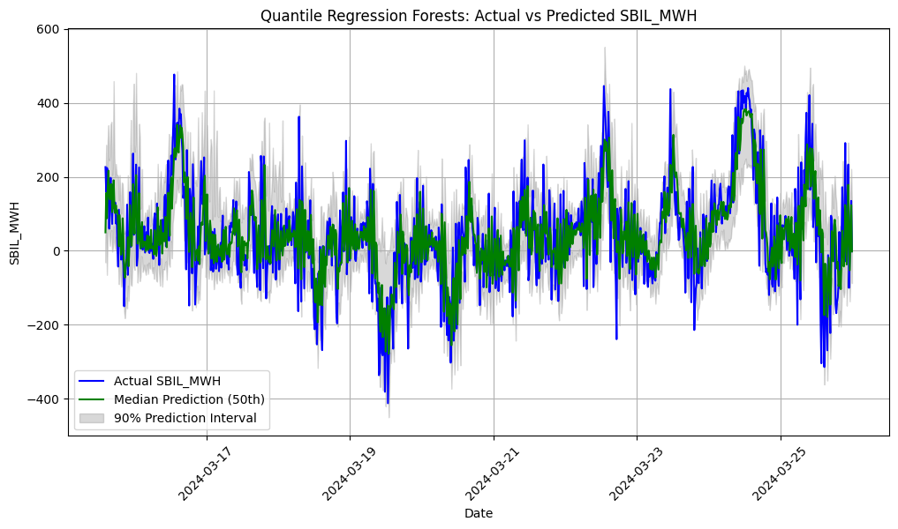

# Predictive Models for Zonal Imbalance Forecasting in the Italian Electricity Market

> This study employs empirical analysis of the Italian electricity grid to identify and analyze the characteristics of system imbalance, with the aim of optimizing short-term redictions. By integrating feature engineering and both linear and non-linear machine learning models, a comprehensive methodology is developed. Key covariates, such as day-ahead and intraday cross-border nominations, autoregressive features, wind power, load, net regulation volumes are identified for inclusion in the predictive models.

An example of probabilistic forecast.
# Methodology Summary

Various linear and nonlinear mean/probabilistic algorithms, including Neural Networks, Regression Trees, and Random Forests, are utilized to predict the system imbalance time series. The most accurate model is then selected for future predictions.

# Overview of the Project

This project begins with analyzing data provided by the transmission system operator, the Italian Power Exchange, and a portfolio of energy assets. For details, see the **data_exploration** folder. We then perform feature selection to identify autoregressive features, ensuring a robust input for the models.

Next, we create a dataset tailored for model training. The dataset includes different features and frequencies to evaluate the optimal combination of inputs. For more information, refer to the **create_dataset_thesis.ipynb** file.

## Models Used
The following models are employed to predict the system imbalance time series:

- **Linear Regression**
- **Feedforward Neural Network**
- **Gradient Boosting Regression Tree**
- **Random Forest**
- **Quantile Random Forest**
- **NAX Model**: A Neural Network combining Autoregression and eXogenous inputs
- [**Conformal Prediction Model**](https://arxiv.org/pdf/2005.07972)

### Note:
The testing and evaluation of these models are conducted in a dedicated Kaggle project. This leverages Kaggle’s GPU resources to accelerate training and grid search processes. These experiments are not included in this repository.

## Forecasting
Once the best model is identified, we implement future forecasts. These include:

- **1-Step Ahead Forecasting**
- **Multi-Step Ahead Forecasting**

Refer to **forecast_imbalance.ipynb** and **forecast_imbalance_multistep.ipynb** for implementation details.